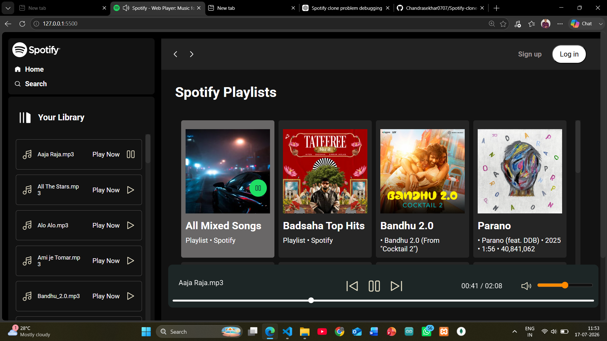
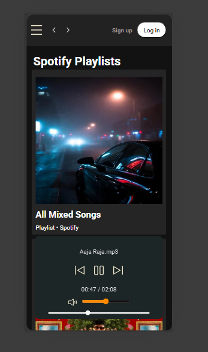

# 🎵 Spotify Clone

A responsive Spotify-inspired music player built using **HTML, CSS, and JavaScript**. This project replicates the core UI and functionality of Spotify Web Player, including dynamic playlist loading, live search, synchronized play/pause controls, and responsive design for desktop and mobile devices.

---

## 🚀 Features

- 🎧 Play, pause, next, and previous song controls
- 📂 Dynamic playlist loading from folders
- 🔍 Live search for playlists and songs
- 🎵 Synchronized play/pause icons
- 📱 Fully responsive for mobile and desktop
- 🔊 Volume control and seek bar
- 📌 Active playlist highlighting
- ❌ “No songs found” message for unmatched searches

---

## 🛠️ Tech Stack

- **HTML5**
- **CSS3**
- **JavaScript (Vanilla JS)**

---

## 📁 Project Structure

```
Spotify-clone-project/
│
├── css/
│   ├── style.css
│   └── utility.css
│
├── img/
│   └── (SVG icons and images)
│
├── js/
│   └── app.js
│
├── songs/
│   └── (Playlist folders with songs)
│
└── index.html
```

---

## 📸 Screenshots

| Desktop | Mobile |
|----------|--------|
|  |  |
---

## ▶️ How to Run Locally

1. Clone the repository
   ```bash
   git clone https://github.com/Chandrasekhar0707/Spotify-clone-project.git
   ```

2. Open the project folder
   ```bash
   cd Spotify-clone-project
   ```

3. Run using **Live Server** in VS Code

---

## 📌 Future Improvements

- ❤️ Favorite songs using LocalStorage
- 🔀 Shuffle mode
- 🔁 Repeat mode
- 🕒 Recently played songs
- 🔐 User authentication (Login/Signup)

---

## 👨‍💻 Author

**Chandrasekhar Samal**

- GitHub: [Chandrasekhar0707](https://github.com/Chandrasekhar0707)
- LinkedIn: [chandrasekhar-samal-a50356318](https://www.linkedin.com/in/chandrasekhar-samal-a50356318)

---

## ⭐ If you like this project

Give it a **star ⭐** on GitHub and feel free to contribute!